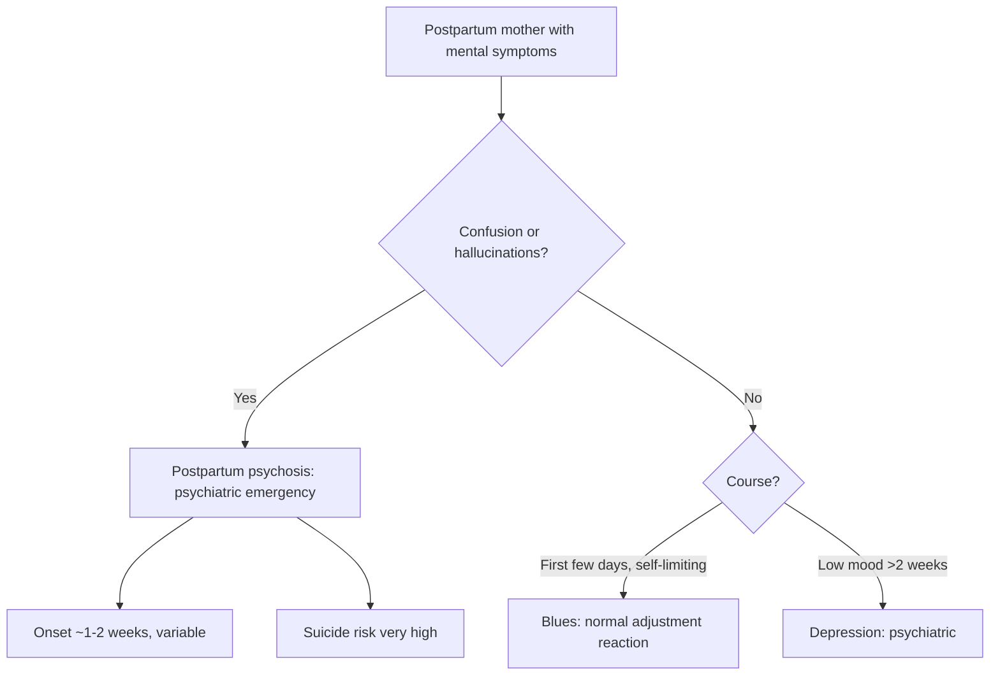
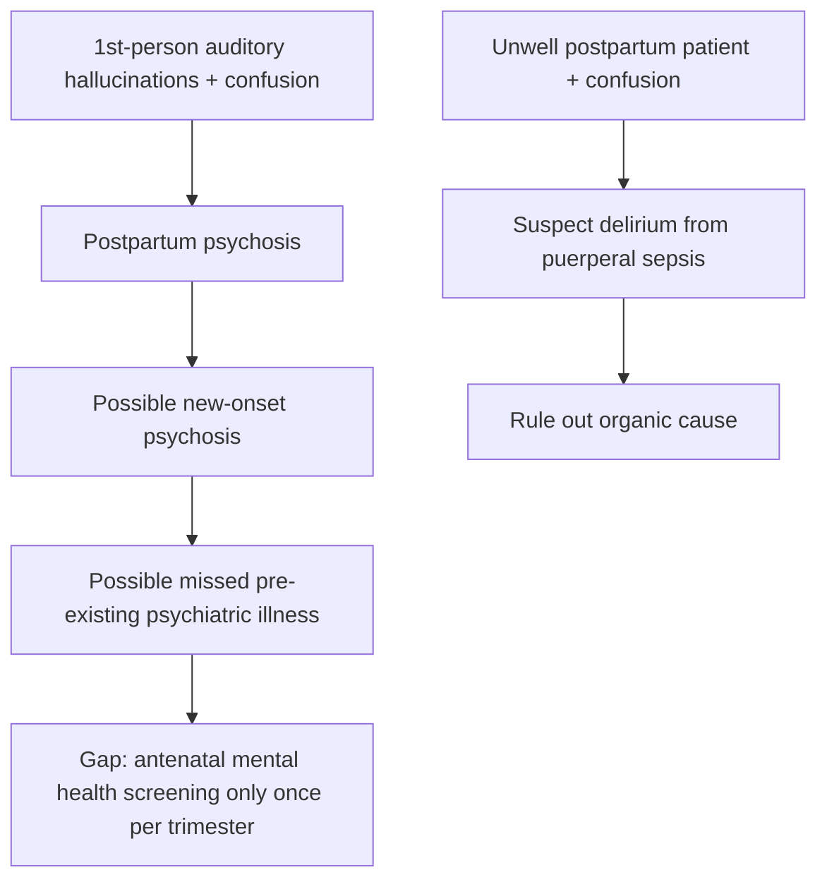
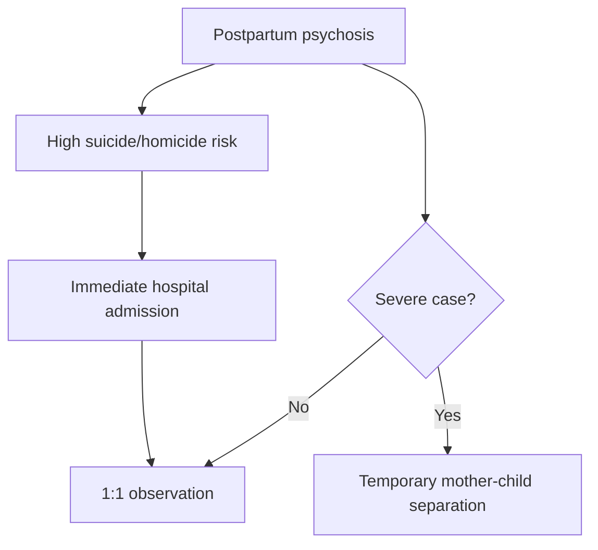
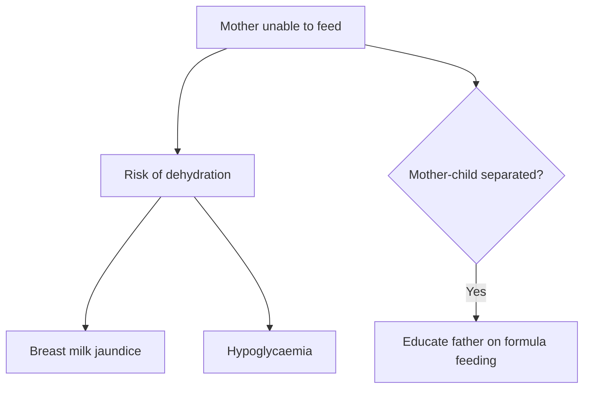
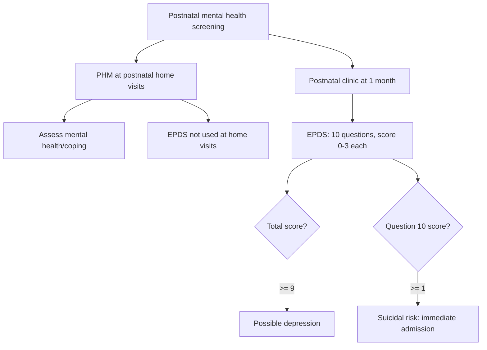

# Postpartum Psychosis: Flowcharts

## Chunk 1: Recognition

```mermaid
flowchart TD
A["Postpartum mother with mental symptoms"] --> B{"Confusion or hallucinations?"}
B -- Yes --> C["Postpartum psychosis: psychiatric emergency"]
B -- No --> D{"Course?"}
D -- "First few days, self-limiting" --> E["Blues: normal adjustment reaction"]
D -- "Low mood >2 weeks" --> F["Depression: psychiatric"]
C --> G["Onset ~1-2 weeks, variable"]
C --> H["Suicide risk very high"]
```

## Chunk 2: Case pattern and organic rule-out

```mermaid
flowchart TD
A["1st-person auditory hallucinations + confusion"] --> B["Postpartum psychosis"]
B --> C["Possible new-onset psychosis"]
C --> D["Possible missed pre-existing psychiatric illness"]
D --> E["Gap: antenatal mental health screening only once per trimester"]
F["Unwell postpartum patient + confusion"] --> G["Suspect delirium from puerperal sepsis"]
G --> H["Rule out organic cause"]
```

## Chunk 3: Management

```mermaid
flowchart TD
A["Postpartum psychosis"] --> B["High suicide/homicide risk"]
B --> C["Immediate hospital admission"]
C --> D["1:1 observation"]
A --> E{"Severe case?"}
E -- Yes --> F["Temporary mother-child separation"]
E -- No --> D
```

## Chunk 4: Newborn effect

```mermaid
flowchart TD
A["Mother unable to feed"] --> B["Risk of dehydration"]
B --> C["Breast milk jaundice"]
B --> D["Hypoglycaemia"]
A --> E{"Mother-child separated?"}
E -- Yes --> F["Educate father on formula feeding"]
```

## Chunk 5: Screening link

```mermaid
flowchart TD
A["Postnatal mental health screening"] --> B["PHM at postnatal home visits"]
A --> C["Postnatal clinic at 1 month"]
B --> D["Assess mental health/coping"]
B --> E["EPDS not used at home visits"]
C --> F["EPDS: 10 questions, score 0-3 each"]
F --> G{"Total score?"}
G -- ">= 9" --> H["Possible depression"]
F --> I{"Question 10 score?"}
I -- ">= 1" --> J["Suicidal risk: immediate admission"]
```
